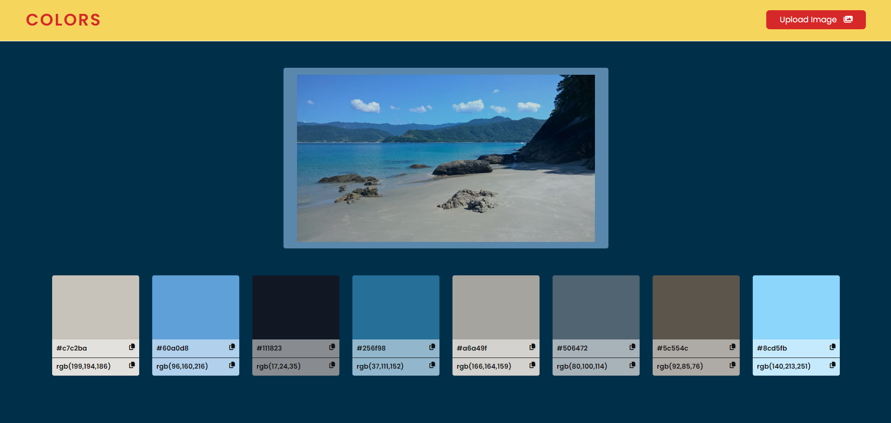
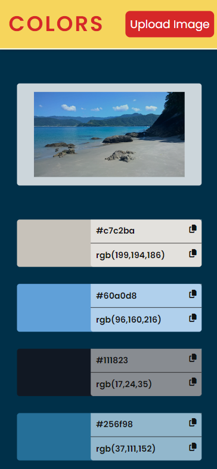

You can read this doc in Portuguese by clicking [here](./README-english.md).

## Image Color Generator

This is a project for generating colors from an image. The user uploads an image, and the application returns 8 colors from its color palette.

## Technologies Used

- HTML
- CSS
- JavaScript
- ReactJS
- ColorThief

## ColorThief

ColorThief is a JavaScript library used to extract the dominant color from an image. This tool is particularly useful in situations where you want to obtain the primary color of an image for use in interface design, graphics, and more. The library uses an algorithm that analyzes the image and identifies the most representative color.

### Main Features of ColorThief:

- **Dominant Color Extraction**: The primary function of ColorThief is to obtain the dominant color from an image.
- **Color Palette**: In addition to the dominant color, the library can extract a color palette, which is the most frequent colors in the image.
- **Easy Integration**: It can be easily integrated into web projects using JavaScript.
- **Browser Compatibility**: It works well in most modern browsers.

## Screenshots

| Computer | Smartphone |
|----------|------------|
|  |  |
